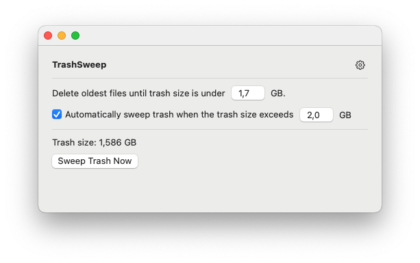

# TrashSweep App

TrashSweep is an application designed to manage and clean up your trash directory using the FIFO (First In, First Out) rule. This ensures that the oldest files are deleted first, keeping your trash directory within a user-defined size limit.

## Download

You can download the latest version of TrashSweep from the following link:

[Download TrashSweep v1.0.1](https://github.com/tranhuycong/trash-sweep/releases/download/v1.0.1/TrashSweep-Installer.dmg)

For all release versions, visit the following link:

[All Releases](https://github.com/tranhuycong/trash-sweep/releases/tag/v1.0.1)

## Features

- **FIFO Trash Management**: Automatically deletes the oldest files first to maintain the trash size within the specified limit.
- **User-Defined Trash Size**: Allows users to set a maximum size for the trash directory.

## How It Works

1. **FIFO Rule**: The application monitors the trash directory and deletes the oldest files first when the total size exceeds the user-defined limit.
2. **Configurable Trash Size**: Users can specify the maximum size for the trash directory. The app will ensure that the total size of files in the trash does not exceed this limit.

## Usage

1. **Set Trash Size**: Define the maximum size for your trash directory in the app settings.
2. **Automatic Cleanup**: The app will automatically manage the trash directory, deleting the oldest files first to keep the total size within the specified limit.

## Updates

For the latest updates and release notes, please refer to the [appcast.xml](appcast.xml) file.

## License

This project is licensed under the MIT License.
